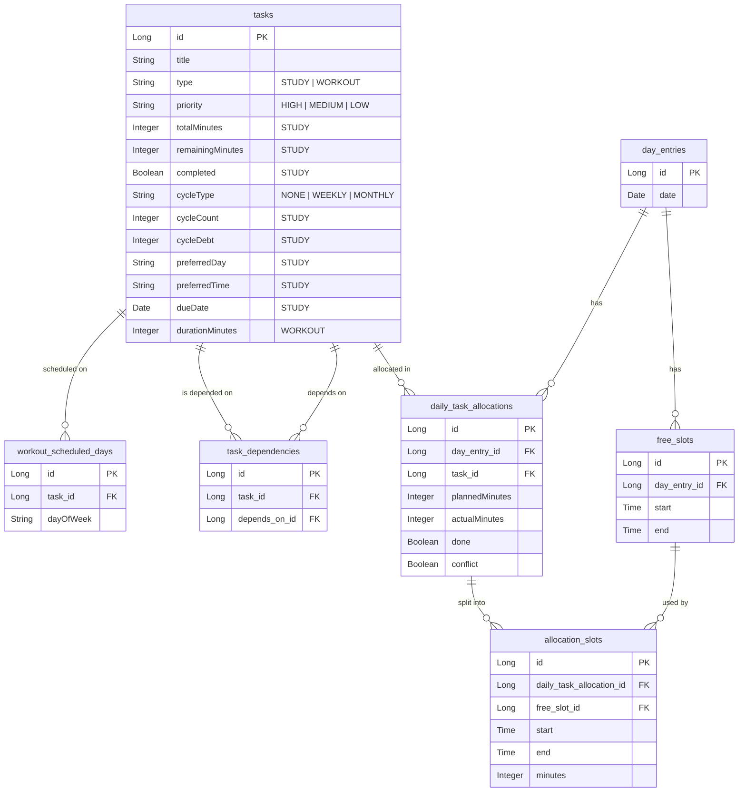

# SlotWise Backend

A scheduling system for managing study and workout tasks, built with Spring Boot.

## Tech Stack

- Java 17
- Spring Boot 3.5
- Spring Data JPA
- MySQL 8
- Lombok
- SpringDoc OpenAPI (Swagger)

## Getting Started

### Prerequisites

- Java 17
- Docker Desktop

### 1. Configure the Database

Copy the template and fill in your credentials:

```bash
cp src/main/resources/application.properties.template src/main/resources/application.properties
```

### 2. Start MySQL

```bash
docker run --name slotwise-mysql \
  -e MYSQL_ROOT_PASSWORD=your_password_here \
  -e MYSQL_DATABASE=slotwise \
  -p 3306:3306 \
  -d mysql:8
```

### 3. Run the Application

```bash
./mvnw spring-boot:run
```

### 4. API Documentation

Visit [http://localhost:8080/swagger-ui/index.html](http://localhost:8080/swagger-ui/index.html)

---

## Requirements

### Req 1 — Task Management
Users can create, edit, and delete two types of tasks:

**Study Tasks**
- Title
- Total duration (in minutes, supports input like "1h", "90min")
- Priority: Important / Normal / Whenever (mapped to HIGH / MEDIUM / LOW)
- Cycle type: None / Weekly / Monthly
- Cycle count: how many times the task must be completed per cycle
- Preferred day: a soft hint for which day of the week to schedule this task
- Preferred time: a soft hint for what time of day
- Due date: optional soft deadline; system boosts priority as due date approaches
- Depends on: a list of other study tasks that must be completed first;
  tasks with unmet dependencies are excluded from scheduling

**Workout Tasks**
- Title
- Duration per session (in minutes)
- Priority: Important / Normal / Whenever
- Scheduled days: one or more days of the week when this task should be done

### Req 2 — Daily Scheduling
- User selects a date on a calendar
- User inputs one or more free time slots for that day (e.g. 09:00–11:00, 20:00–22:00)
- System auto-generates a daily plan by fitting tasks into those slots:
  - Workout tasks are scheduled first, only on their designated days, as whole blocks
  - If a workout task doesn't fit, it is flagged as a conflict and the user is notified
  - Study tasks are then filled in by priority order
  - Study tasks can be split across multiple free slots
  - Tasks with unmet dependencies are skipped
  - Tasks behind on their cycle requirement are boosted to highest priority
  - Tasks with a due date within 3 days are also boosted
- Free slots can be added, edited, and deleted; schedule updates automatically
- Calendar shows public holidays (via Nager.Date API) and weekends in red
- User can select region to load the correct public holidays

### Req 3 — Actual Time Logging
After completing (or attempting) a task each day, the user logs progress:

**Done:**
- User marks the allocation as Done and enters actual minutes used
- System deducts actual minutes from task's remaining minutes
- If actual < planned: user is asked if they want to reschedule freed time
- If actual > planned: system auto-reschedules

**Not Done:**
- User marks as Not Done and enters how many minutes they spent
- System auto-calculates new remaining minutes (can be manually adjusted)
- Schedule is automatically regenerated

### Req 4 — Cycle Tracking & Debt
- Study tasks with a cycle requirement (weekly/monthly N times) are tracked
- If a previous cycle ended with fewer completions than required,
  the shortfall (cycleDebt) is carried over to the current cycle
- Cycle debt settlement happens automatically each time a schedule is generated
- Tasks that are behind on their cycle are prioritized in scheduling

### Req 5 — Workout Statistics
- User can view how many times each workout task was planned and completed
- Filterable by week (e.g. 2026-W18) or month (e.g. 2026-05)
- Shows per-task breakdown with dates and done/not-done status

---

## Data Model



---

## API Endpoints

| Method | Path | Description |
|---|---|---|
| POST | /tasks/study | Create study task |
| POST | /tasks/workout | Create workout task |
| PUT | /tasks/study/{id} | Update study task |
| PUT | /tasks/workout/{id} | Update workout task |
| GET | /tasks | Get all tasks |
| GET | /tasks/{id} | Get task by ID |
| DELETE | /tasks/{id} | Delete task |
| POST | /tasks/{id}/dependencies/{dependsOnId} | Add dependency |
| DELETE | /tasks/{id}/dependencies/{dependsOnId} | Remove dependency |
| GET | /tasks/{id}/dependencies | Get dependencies |
| POST | /day-entries | Create day entry with free slots |
| GET | /day-entries/{date} | Get day entry |
| POST | /day-entries/{date}/free-slots | Add free slot |
| PUT | /day-entries/{date}/free-slots/{id} | Update free slot |
| DELETE | /day-entries/{date}/free-slots/{id} | Delete free slot |
| POST | /day-entries/{date}/schedule | Generate schedule |
| GET | /day-entries/{date}/schedule | Get existing schedule |
| PUT | /day-entries/{date}/allocations/{id} | Log actual time |
| GET | /stats/workout/weekly | Weekly workout stats |
| GET | /stats/workout/monthly | Monthly workout stats |

---

## Project Structure

```
slotwise-backend/
└── src/main/java/com/slotwise/slotwise/
    ├── controller/     # REST controllers
    ├── service/        # Business logic
    ├── repository/     # JPA repositories
    ├── model/          # Database entities
    ├── dto/
    │   ├── request/    # Incoming request bodies
    │   └── response/   # Outgoing response bodies
    ├── enums/          # TaskType, Priority, CycleType
    ├── exception/      # GlobalExceptionHandler, ResourceNotFoundException
    └── config/         # CorsConfig
slotwise-web/
└── src/
    ├── api/            # Axios API calls (tasks.js, dayEntries.js, holidays.js)
    ├── pages/          # TasksPage, SchedulePage, StatsPage
    └── components/ui/  # shadcn/ui components
```

---

## TODO
### Features
- [ ] Cycle progress page: show per-task cycle progress in the UI
- [ ] Task ordering: allow user to manually reorder tasks within same priority

### Tests
- [ ] Add unit tests