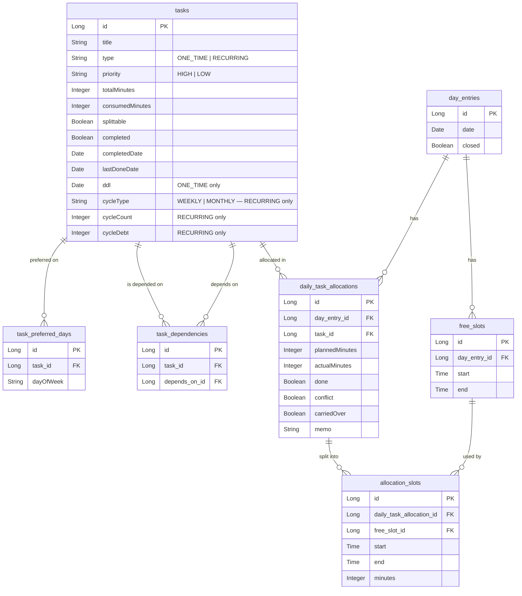

# SlotWise Backend

A personal scheduling system for managing tasks and fitting them into daily free time, built with Spring Boot.

## Tech Stack

- Java 17
- Spring Boot 3.5
- Spring Data JPA
- MySQL 8
- Lombok
- SpringDoc OpenAPI (Swagger)

## Getting Started

### Prerequisites

- Java 17
- Docker Desktop

### 1. Configure the Database

Copy the template and fill in your credentials:

```bash
cp src/main/resources/application.properties.template src/main/resources/application.properties
```

### 2. Start MySQL

```bash
docker run --name slotwise-mysql \
  -e MYSQL_ROOT_PASSWORD=your_password_here \
  -e MYSQL_DATABASE=slotwise \
  -p 3306:3306 \
  -d mysql:8
```

### 3. Run the Application

```bash
./mvnw spring-boot:run
```

### 4. API Documentation

Visit [http://localhost:8080/swagger-ui/index.html](http://localhost:8080/swagger-ui/index.html)

---

## Requirements

### Req 1 — Task Management

Users can create, edit, and delete two types of tasks:

**One-time Tasks**
- Title, priority (Must / Normal), total duration
- Splittable: whether the task can be spread across multiple days/slots
- Deadline (optional): hard cutoff; system boosts priority when ≤ 3 days away
- Depends on: other tasks that must be completed first; blocks scheduling until met
- Status and remaining minutes can be edited from the task list

**Recurring Tasks**
- Title, priority (Must / Normal), duration per session
- Splittable: whether a single session can be split across slots
- Cycle type (Weekly / Monthly) and cycle count (N sessions per cycle)
- Preferred days: optional days of the week the task prefers to be scheduled on
- Cycle debt: sessions missed in the previous cycle are carried over and prioritised

### Req 2 — Daily Scheduling

- User selects a date on a calendar; public holidays and weekends are highlighted in red
- User enters one or more free time slots for the day (e.g. 09:00–11:00, 20:00–22:00); slots can be added, edited, or deleted at any time
- Clicking **Update** generates (or regenerates) the day's task plan by fitting tasks into those free slots
- The week overview shows all 7 days with task summaries; a single **Update** button regenerates all open days in the week that have entries

#### How tasks are selected and ordered

The scheduler runs in two passes:

**Pass 1 — Recurring tasks with a preferred day matching today**
These are scheduled first, in Must-before-Normal order:
- A Must (HIGH) task that cannot fit is flagged as a conflict so the user is aware
- A Normal (LOW) task that cannot fit is silently skipped

**Pass 2 — Everything else**
All remaining incomplete tasks are considered, sorted from highest to lowest urgency:
1. One-time tasks whose deadline has already passed
2. Recurring tasks behind on their cycle quota for the current period
3. One-time tasks with a deadline within the next 3 days
4. Must (HIGH) priority tasks
5. Normal (LOW) priority tasks

Recurring tasks are only scheduled in this pass if they are behind on quota; tasks whose dependencies are not yet completed are skipped entirely.

#### How tasks are fitted into free slots

- **Non-splittable tasks** require a single uninterrupted block of time large enough for the full duration; if no such block exists the task is skipped (Pass 2) or flagged as conflict (Pass 1, Must only)
- **Splittable tasks** fill whatever free time is available across one or more slots, up to the remaining duration

When the schedule is regenerated on a day that already has logged or carried-over entries, those entries' time blocks are treated as occupied and new tasks are placed around them — no logged time is overwritten.

#### Closing a day

Once the user is done for the day, they click **Call it a day**:
- The day is locked; its plan can no longer be edited or regenerated
- Any tasks that were not logged (unfinished or untouched) are automatically carried over to tomorrow, marked as "Carried over", and slotted into tomorrow's schedule if tomorrow already has free slots defined
- A closed day shows a lock indicator in the week overview

If needed, the user can **Reopen** a closed day to make changes again.

### Req 3 — Actual Time Logging

After completing (or attempting) a task each day, the user logs progress via an inline form:

**Done:**
- Mark the allocation as Done, enter actual minutes used, add an optional memo
- Consumed minutes are incremented on the task; task is immediately marked `completed = true` regardless of remaining minutes (the user's intent is authoritative)

**Not Done:**
- Mark as Not Done, enter minutes spent, optionally override the remaining minutes, add a memo
- Consumed minutes are updated accordingly

Logged sessions (both done and not done) appear on the Tasks page with date, minutes, and memo.

### Req 4 — Cycle Tracking & Debt

- Recurring tasks with a cycle requirement (weekly/monthly N times) are tracked
- If a previous cycle ended with fewer completions than required,
  the shortfall (cycleDebt) is carried over to the current cycle
- Cycle debt settlement happens automatically each time a schedule is generated
- Tasks behind on their cycle quota are boosted to highest scheduling priority

---

## Data Model



---

## API Endpoints

| Method | Path | Description |
|---|---|---|
| POST | /tasks | Create task |
| PUT | /tasks/{id} | Update task |
| PUT | /tasks/{id}/progress | Update task progress (status / consumed minutes) |
| GET | /tasks | Get all tasks |
| GET | /tasks/{id} | Get task by ID |
| DELETE | /tasks/{id} | Delete task |
| POST | /tasks/{id}/dependencies/{dependsOnId} | Add dependency |
| DELETE | /tasks/{id}/dependencies/{dependsOnId} | Remove dependency |
| GET | /tasks/{id}/dependencies | Get dependencies |
| POST | /day-entries | Create day entry with free slots |
| GET | /day-entries/{date} | Get day entry |
| POST | /day-entries/{date}/free-slots | Add free slot |
| PUT | /day-entries/{date}/free-slots/{id} | Update free slot |
| DELETE | /day-entries/{date}/free-slots/{id} | Delete free slot |
| POST | /day-entries/{date}/schedule | Generate / update schedule |
| GET | /day-entries/{date}/schedule | Get existing schedule |
| PUT | /day-entries/{date}/allocations/{id} | Log actual time and memo |
| DELETE | /day-entries/{date}/allocations/{id}/log | Clear a logged entry |
| POST | /day-entries/{date}/call-it-a-day | Close day and carry over unfinished tasks |
| POST | /day-entries/{date}/reopen | Reopen a closed day |

---

## Project Structure

```
slotwise-backend/
└── src/main/java/com/slotwise/slotwise/
    ├── controller/     # REST controllers
    ├── service/        # Business logic
    ├── repository/     # JPA repositories
    ├── model/          # Database entities
    ├── dto/
    │   ├── request/    # Incoming request bodies
    │   └── response/   # Outgoing response bodies
    ├── enums/          # TaskType, Priority, CycleType
    ├── exception/      # GlobalExceptionHandler, ResourceNotFoundException
    └── config/         # CorsConfig
slotwise-web/
└── src/
    ├── api/            # Axios API calls (tasks.js, dayEntries.js, holidays.js)
    ├── pages/          # TasksPage, SchedulePage, StatsPage
    └── components/ui/  # shadcn/ui components
```

---

## TODO

- [ ] Cycle progress view: show per-task cycle completion status in the UI
- [ ] Stats page: rebuild for new task model (recurring task completion history)
